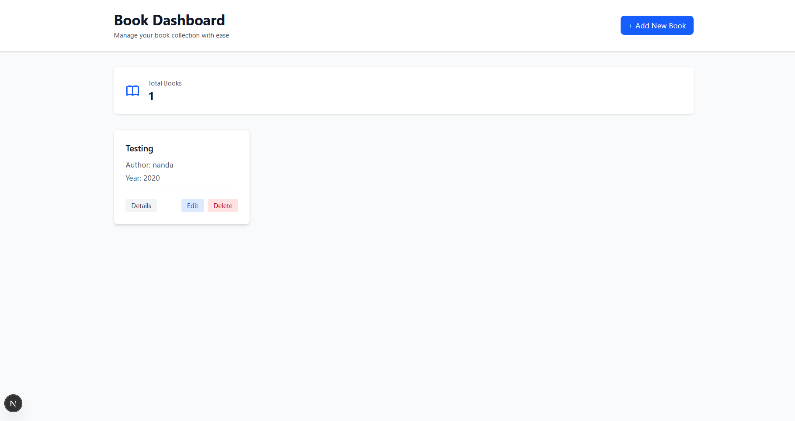
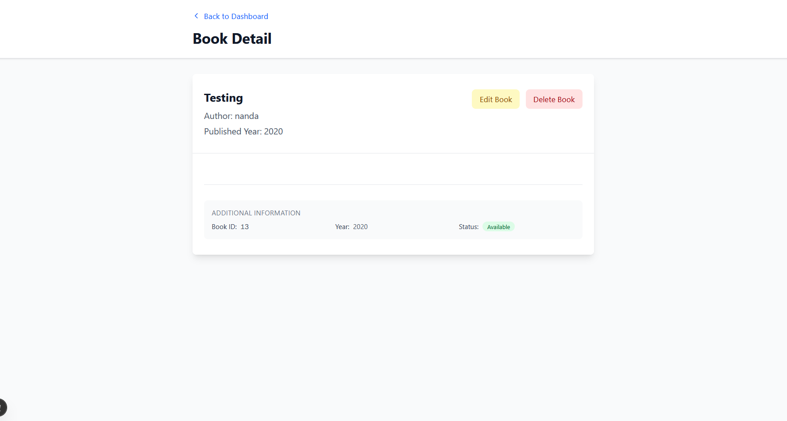
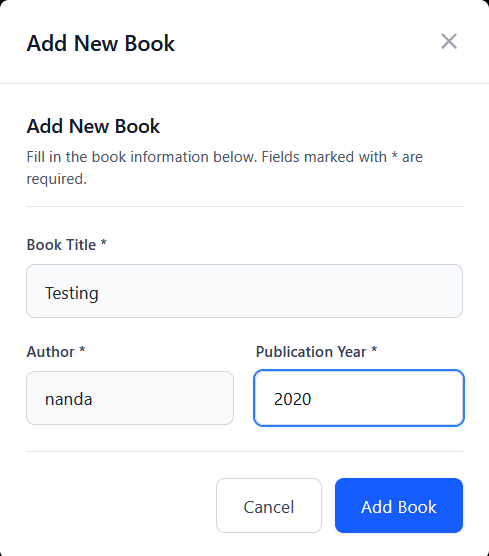
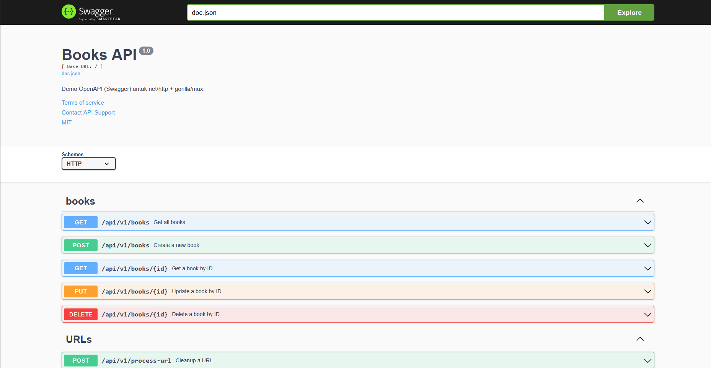

# Book App

A full-stack application for managing books, built with Go (backend) and Next.js (frontend).

## Project Structure

```
byfood-interview/
├── backend/         # Go backend API
├── frontend/        # Next.js frontend
├── docker-compose.yml
├── README.md        # Project overview and instructions
```

- **backend/**: Contains the Go REST API, business logic, migrations, and tests.
- **frontend/**: Contains the Next.js web application.
- **docker-compose.yml**: For running backend and frontend together using Docker.

## Setup Instructions

### Prerequisites
- Docker & Docker Compose
- Go (for backend development)
- Node.js & npm (for frontend development)

### Running with Docker Compose

```zsh
docker-compose up --build
```

- Backend: http://localhost:8080
- Frontend: http://localhost:3000

### Running Backend Locally

```zsh
cd backend

cp .env.example .env

make run
```

### Backend .env Example

Copy file `.env.example` ke `.env` and adjust the following variables according to your needs:

```env
DB_HOST=localhost
DB_PORT=5432
DB_USER=nanda
DB_PASSWORD=password
DB_NAME=byfood
HTTP_PORT=8080
```

- **DB_HOST**: Host PostgreSQL
- **DB_PORT**: Database port
- **DB_USER**: Database username
- **DB_PASSWORD**: Database password
- **DB_NAME**: Database name
- **HTTP_PORT**: Port backend

### Running Frontend Locally

```zsh
cd frontend
npm install

cp .env.example .env

npm run dev
```

### Frontend .env Example

Copy file `.env.example` ke `.env` and adjust the following variables according to your needs:

```env
NEXT_PUBLIC_API_URL=http://localhost:8080
```
- **NEXT_PUBLIC_API_URL**: URL Backend API


## API Endpoints

See backend API documentation:
- Swagger: [`backend/docs/swagger.json`](backend/docs/swagger.json) or [`backend/docs/swagger.yaml`](backend/docs/swagger.yaml)
- URL Swagger (example): http://localhost:8080/swagger
- Example endpoints:
  - `GET /books` - List all books
  - `POST /books` - Create a new book
  - `GET /books/{id}` - Get book details
  - `PUT /books/{id}` - Update a book
  - `DELETE /books/{id}` - Delete a book

## Testing

- **Backend**: Unit and integration test instructions are provided in [`backend/TEST_README.md`](backend/TEST_README.md). Please refer to that file for details on running and understanding backend tests.
- **Frontend**: Standard Next.js testing setup (add your preferred testing library).

## Screenshots

### Dashboard


### Detail Book


### Modal Add Book


### Swagger API Docs

Api Docs using swagger ui


